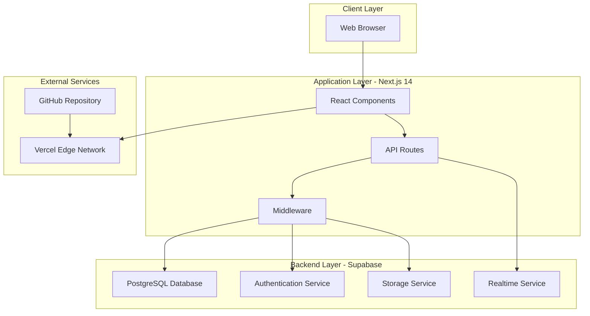
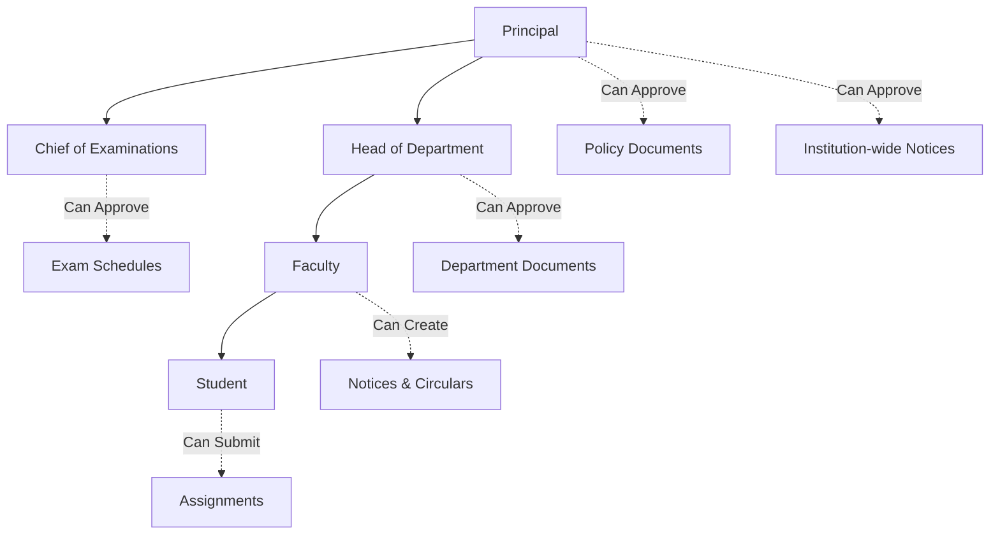
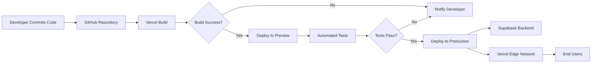
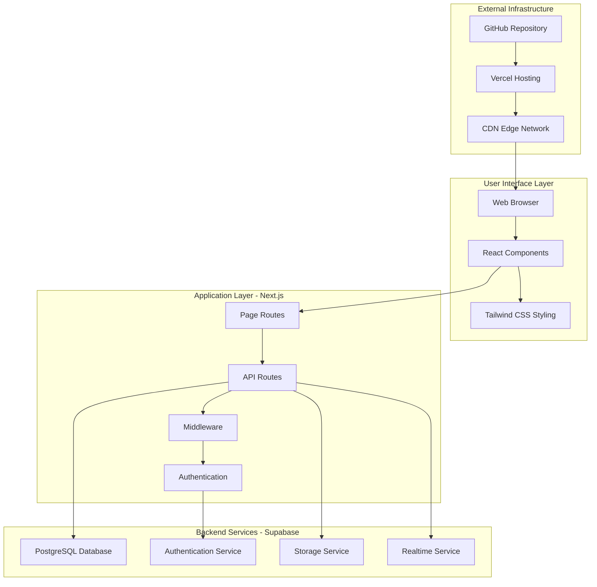
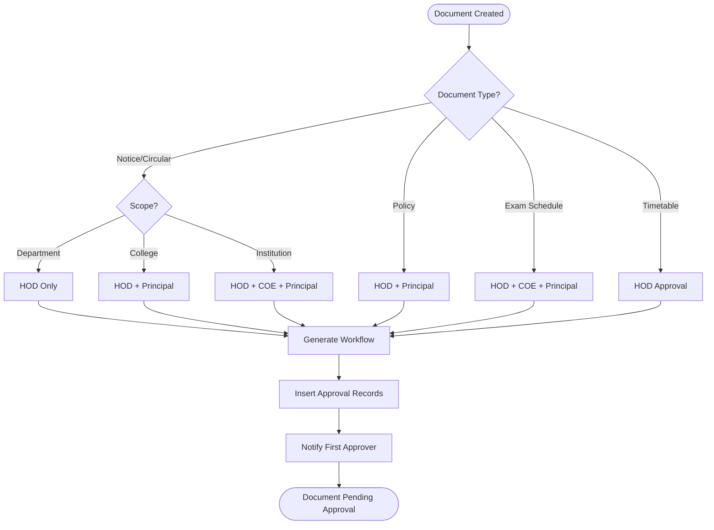

# Project Daily Diary
## Digital Document Management & Approval System for Educational Institutions

**Project Name:** EduSphere AI - College Workflow Automation  
**Institution:** MGM University School of Engineering & Technology  
**Technology Stack:** Next.js 14, TypeScript, Supabase, Tailwind CSS  
**Duration:** Academic Year 2024-2025  

---

# SYSTEM DESIGN (8 Pages)

## Page 1: Project Overview and Problem Statement

### Introduction to Educational Document Management
The educational sector faces significant challenges in managing the flow of administrative documents across multiple hierarchical levels. Traditional paper-based systems lead to delays, lack of transparency, and difficulty in tracking approval workflows. Our project addresses these challenges by developing a comprehensive digital document management system specifically designed for educational institutions. The system implements role-based access control with automated workflow generation based on document type, department scope, and institutional policies. By digitizing the entire document lifecycle from creation to approval and archival, we eliminate manual bottlenecks and provide real-time visibility into document status. The platform supports multiple user roles including students, faculty, HODs, COEs, and principals, each with specific permissions and responsibilities. Integration with Supabase backend ensures scalable, secure, and reliable data management with real-time synchronization capabilities.

### Problem Identification and Scope Definition
Educational institutions handle diverse document types including timetables, exam schedules, notices, circulars, and policy documents, each requiring different approval hierarchies. The absence of a unified platform results in fragmented communication, lost documents, and accountability gaps. Students and faculty lack visibility into the approval status of their submissions, leading to repeated inquiries and administrative burden. The current system does not maintain comprehensive audit trails, making compliance verification and dispute resolution challenging. Our solution aims to create a centralized platform that automates workflow generation based on predefined rules, ensures proper authorization at each approval step through digital signatures, and maintains complete audit logs for every action. The scope includes document upload with metadata tagging, dynamic approval routing, real-time notifications, digital signature integration, notice board functionality for institutional announcements, and comprehensive analytics dashboards. The system is designed to be scalable, allowing future expansion to include assignment management, examination workflows, and inter-departmental coordination features.

---

## Page 2: System Architecture and Technology Stack

### High-Level System Architecture
The system follows a modern three-tier architecture with clear separation of concerns between presentation, application logic, and data persistence layers. The frontend layer is built using Next.js 14 with React 18, providing server-side rendering capabilities for improved performance and SEO. The application layer implements RESTful API routes within Next.js API directory, handling business logic, authentication, and authorization. The data layer utilizes Supabase PostgreSQL database for relational data storage with row-level security policies ensuring data isolation. Supabase Storage provides secure file storage for document attachments and digital signatures with URL-based access control. Authentication is managed through Supabase Auth with JWT token-based session management, supporting email-password authentication with plans to extend to OAuth providers. The architecture employs middleware patterns for request validation, error handling, and logging across all API endpoints. Real-time capabilities are achieved through Supabase Realtime subscriptions enabling instant notification delivery and status updates without polling.

### Technology Stack Justification and Component Selection
Next.js 14 was selected for its hybrid rendering capabilities, allowing server-side rendering for dynamic content and static generation for public pages. TypeScript provides type safety reducing runtime errors and improving code maintainability through compile-time checks. Tailwind CSS enables rapid UI development with utility-first approach and custom theme configuration matching institutional branding. Supabase offers a complete backend-as-a-service solution combining PostgreSQL database, authentication, storage, and real-time subscriptions in a single platform. The choice of PostgreSQL ensures ACID compliance critical for audit trail integrity and supports complex queries for analytics. Vercel deployment platform provides edge caching, automatic HTTPS, and seamless integration with Next.js framework. Git version control with GitHub enables collaborative development, code review workflows, and continuous integration. The stack prioritizes developer experience with hot reload, TypeScript IntelliSense, and comprehensive documentation while ensuring production-grade performance and security. Future scalability is addressed through Supabase's horizontal scaling capabilities and Next.js edge runtime support.



---

## Page 3: Database Schema Design

### Core Entity Relationships and Data Model
The database schema is designed with normalization principles ensuring data integrity and minimizing redundancy. The users table serves as the central entity storing authentication details, role information, department affiliation, and profile metadata. The documents table represents all uploadable content with fields for title, type, department, scope, status, file URL, and timestamps. The workflows table captures the approval process definition generated dynamically based on document context, storing the complete approval chain as JSONB. The approvals table tracks individual approval steps linking to workflows with fields for required role, approver assignment, status, signature URL, and action timestamps. The audit_logs table maintains immutable records of every system action creating comprehensive compliance trails. The notifications table manages real-time alerts to users about pending actions and status changes. The notice_recipients table implements many-to-many relationships between notices and their target audience based on roles or departments. Database indexes are strategically placed on foreign keys, status fields, and timestamp columns optimizing query performance for dashboard views and reporting.

### Advanced Schema Features and Constraints
Row-level security policies enforce data access controls at the database layer preventing unauthorized access even if application logic is bypassed. Foreign key constraints with CASCADE options ensure referential integrity when documents or workflows are deleted. Check constraints validate data integrity such as ensuring status values are from predefined enumerations. Unique constraints prevent duplicate entries for critical fields like user emails and document-workflow relationships. The generated_steps column in workflows uses JSONB type allowing flexible storage of approval hierarchies without schema modifications. Computed columns and database views like published_notices simplify complex queries by pre-joining related tables. Triggers could be implemented for automatic timestamp updates and validation logic that must execute atomically with data changes. The schema supports horizontal scaling through proper indexing and query optimization with query execution plans analyzed for bottlenecks. Backup strategies include automated daily snapshots with point-in-time recovery capabilities ensuring data durability and disaster recovery compliance.

```
┌─────────────────┐         ┌──────────────────┐         ┌─────────────────┐
│     USERS       │         │    DOCUMENTS     │         │    WORKFLOWS    │
├─────────────────┤         ├──────────────────┤         ├─────────────────┤
│ id (PK)         │◄───────┤│ id (PK)          │────────►│ id (PK)         │
│ email           │         │ title            │         │ document_id (FK)│
│ role            │         │ type             │         │ policy_valid    │
│ department      │         │ department       │         │ generated_steps │
│ full_name       │         │ scope            │         │ created_at      │
│ created_at      │         │ creator_id (FK)  │         └─────────────────┘
└─────────────────┘         │ status           │                  │
                           │ file_url         │                  │
                           │ created_at       │                  ▼
                           └──────────────────┘         ┌─────────────────┐
                                    │                   │   APPROVALS     │
                                    │                   ├─────────────────┤
                                    ▼                   │ id (PK)         │
                           ┌──────────────────┐         │ workflow_id (FK)│
                           │   AUDIT_LOGS     │         │ step_order      │
                           ├──────────────────┤         │ status          │
                           │ id (PK)          │         │ signature_url   │
                           │ document_id (FK) │         │ acted_at        │
                           │ actor_id (FK)    │         │ comment         │
                           │ action           │         └─────────────────┘
                           │ details          │
                           │ timestamp        │
                           └──────────────────┘
```

---

## Page 4: User Role Hierarchy and Access Control

### Role-Based Permission Matrix
The system implements five primary user roles with hierarchical privileges ensuring appropriate access controls. Students have read-only access to approved documents, can upload assignment submissions, and receive notifications about their document status. Faculty members can create notices, circulars, and departmental documents, view documents within their department, and approve submissions from students. Heads of Department possess all faculty privileges plus approval authority for department-scoped documents, ability to manage faculty submissions, and oversight of departmental analytics. Chief of Examinations has specialized permissions for exam schedules, timetable approvals, and examination-related workflows independent of regular department hierarchies. Principals have institution-wide visibility, final approval authority for policy documents, access to comprehensive analytics across all departments, and system configuration capabilities. Each role has distinct dashboard views showing only relevant information and actionable items preventing information overload and ensuring users focus on their responsibilities.

### Authentication and Authorization Implementation
Authentication is handled through Supabase Auth providing secure password hashing with bcrypt, JWT token generation with configurable expiration, and session management with automatic refresh capabilities. Upon successful login, user metadata including role and department is fetched and stored in the session context accessible throughout the application. Authorization checks occur at multiple layers including middleware validation before API route execution, database row-level security policies preventing unauthorized data access, and frontend route guards redirecting users attempting to access restricted pages. API endpoints verify user identity through JWT validation and check permissions based on the requested action and target resource. Digital signature upload is restricted to users whose role matches the required approver role in the workflow step, not based on pre-assigned approver IDs. Sensitive operations like document deletion and approval require additional verification ensuring only authorized personnel can perform critical actions. Session timeout and inactivity detection automatically log out users after predefined periods enhancing security.



---

## Page 5: Dynamic Workflow Generation Algorithm

### Context Analysis and Approval Chain Construction
The workflow generation system analyzes document metadata to determine the appropriate approval hierarchy automatically. The analyzeDocumentContext function examines document type, scope (department, college, institution), creator role, and category to construct approval requirements. For notices and circulars, scope dictates the approval chain: department scope requires only HOD approval, college scope requires HOD and Principal, while institution scope requires approval from all administrative levels. Policy documents always require HOD and Principal approval regardless of creator role ensuring institutional oversight. Exam schedules and timetables require specialized routing through COE for validation before final administrative approval. The algorithm ensures compliance with institutional policies by implementing hard-coded validation rules that cannot be bypassed. Generated workflows are stored as JSONB in the workflows table capturing step order, required role, and optional validation logic for each approval stage. Workflow validation occurs before insertion ensuring all steps are logically ordered and required approvers exist within the system.

### Approval Step Execution and State Management
Each approval in the workflow moves through distinct states: pending, approved, and rejected. When a document enters the approval process, approval records are created for each workflow step with initial pending status. Approvers with matching roles see pending approvals on their dashboard with relevant document metadata and approval step details. Upon action, approvers can approve with digital signature upload or reject with mandatory comments explaining the rationale. The system validates that only users with the required role can act on specific approval steps preventing unauthorized actions. After each approval action, the system checks if all steps in the workflow are approved to transition the entire document to approved status. Rejection at any step immediately sets the document status to rejected and notifies the creator with rejection comments. Auto-publish logic triggers for approved notices without scheduled publication dates, automatically calling the publish API endpoint to make notices visible on the notice board. Audit logs capture every approval action with timestamps, actor identity, and action details ensuring complete traceability.

```typescript
// Workflow Generation Logic Example
interface WorkflowStep {
  stepOrder: number;
  requiredRole: 'hod' | 'coe' | 'principal';
  description: string;
}

function analyzeDocumentContext(document) {
  const steps: WorkflowStep[] = [];
  
  if (document.type === 'notice' || document.type === 'circular') {
    if (document.scope === 'department') {
      steps.push({ stepOrder: 1, requiredRole: 'hod', description: 'HOD Approval' });
    } else if (document.scope === 'college') {
      steps.push({ stepOrder: 1, requiredRole: 'hod', description: 'HOD Approval' });
      steps.push({ stepOrder: 2, requiredRole: 'principal', description: 'Principal Approval' });
    } else if (document.scope === 'institution') {
      steps.push({ stepOrder: 1, requiredRole: 'hod', description: 'HOD Approval' });
      steps.push({ stepOrder: 2, requiredRole: 'coe', description: 'COE Review' });
      steps.push({ stepOrder: 3, requiredRole: 'principal', description: 'Principal Approval' });
    }
  }
  
  return steps;
}
```

---

## Page 6: Digital Signature Integration

### Signature Capture and Storage Architecture
Digital signatures provide non-repudiation ensuring approvers cannot deny their approval actions. The signature capture interface uses HTML5 canvas allowing users to draw signatures with mouse or touch input. Captured signatures are converted to PNG format ensuring lossless quality and reasonable file sizes. Before upload, client-side validation checks signature dimensions and file size preventing empty or corrupted submissions. The signature upload API endpoint validates file type allowing only PNG images, authenticates the user through JWT token validation, and verifies the user's role matches the required approver role for the specific workflow step. Signatures are stored in Supabase Storage under a user-specific directory structure organized by user ID and approval ID ensuring isolation. Storage paths are recorded in the approvals table creating an immutable link between approval actions and signature artifacts. Access to signatures is controlled through signed URL generation with expiration timestamps preventing unauthorized access to signature files.

### Signature Verification and Compliance Features
The system maintains signature integrity by storing original uploaded files without modifications allowing forensic verification if disputes arise. Each signature upload is timestamped with millisecond precision providing temporal evidence of approval actions. The audit logs capture signature URLs along with approval actions creating tamper-evident records of the approval process. Signature validation during upload ensures only authorized users can sign specific approval steps by matching user roles against workflow requirements. If an approval action fails after signature upload, the system performs automatic rollback deleting the uploaded signature from storage preventing orphaned files. Future enhancements could include biometric signature analysis, signature comparison for user verification, and cryptographic signature generation using private-public key pairs. The current implementation focuses on usability and audit compliance ensuring approvers have accountability for their decisions. Export functionality could generate PDF certificates of approved documents with embedded signature images suitable for offline verification and archival purposes.

---

## Page 7: Notice Board and Publication System

### Notice Creation and Approval Workflow
The notice board system provides dedicated interfaces for creating and publishing institutional announcements separate from regular document upload flows. Faculty, HODs, and principals can create notices through a specialized form capturing title, category, content, file attachments, publication date, and recipient targeting. Categories include Academic, Administrative, Events, Holidays, Urgent, Examinations, and General allowing users to filter notices based on their interests. Recipients can be targeted by role (student, faculty, hod, coe, principal) or department ensuring relevant notices reach the intended audience without information overload. Notices undergo the same approval workflow as regular documents based on scope and type ensuring proper authorization before publication. The publication_date field allows scheduling future notices though current implementation publishes all approved notices immediately for operational simplicity. Upon final approval, the auto-publish mechanism triggers automatically calling the publish API endpoint which sets is_published flag and records published_at timestamp. Published notices appear on the notice board for all targeted recipients with filtering, search, and categorization capabilities enhancing discoverability.

### Notice Board Display and Filtering Logic
The notice board page fetches published notices from the published_notices database view joining documents with creator information. Client-side filtering evaluates notice relevance for the current user by checking scope, department matching, and recipient targeting rules. Institution-scoped notices are visible to all users, college-scoped notices to all users within the college, and department-scoped notices only to users in the matching department. Additional filtering through notice_recipients table allows fine-grained targeting where specific roles or departments receive notices regardless of scope. Users can search notices by title using real-time client-side filtering providing instant results without server round-trips. Category tabs enable quick filtering to specific notice types reducing visual clutter and helping users focus on relevant information. Each notice card displays title, category badge, publication date, creator details, content preview, and optional attachment link. Clicking attachment links generates signed URLs from Supabase Storage with short expiration times ensuring secure access to notice files. The interface follows institutional branding with custom color schemes defined in Tailwind CSS configuration ensuring visual consistency across the application.

---

## Page 8: Analytics and Reporting Dashboard

### Key Performance Indicators and Metrics
The analytics dashboard provides actionable insights into document workflow efficiency and institutional activity patterns. Core metrics include total documents uploaded segmented by type and department, pending approvals count by role showing workload distribution, average approval time measuring workflow efficiency, and rejection rate identifying problematic document categories. Approval velocity metrics track how quickly documents move through approval stages highlighting bottlenecks at specific approval steps. User activity statistics show document creation trends over time helping administrators understand busy periods. Department-wise analytics compare document volumes and approval speeds across departments enabling performance benchmarking. Notice board metrics track notice publication frequency, category distribution, and recipient reach ensuring effective communication. Real-time dashboards update automatically when new documents are created or approvals are acted upon providing current visibility. Export functionality allows downloading reports in CSV format for offline analysis and record-keeping purposes.

### Data Visualization and Reporting Features
The analytics page employs charts, graphs, and summary cards presenting complex data in easily digestible formats. Bar charts compare document volumes across departments and types showing relative activity levels. Line graphs display approval trends over time identifying seasonal patterns and workload variations. Pie charts illustrate status distribution showing proportions of pending, approved, and rejected documents. Summary cards highlight critical numbers like pending approvals count, average approval time, and documents uploaded this week. Color coding uses institutional theme colors with red for urgent items, green for completed actions, and amber for pending states. Responsive design ensures dashboards are accessible on tablets and mobile devices allowing administrators to monitor workflows remotely. Future enhancements could include predictive analytics forecasting approval completion times, anomaly detection identifying unusual patterns, and custom report builders allowing users to define their own metrics. Integration with business intelligence tools like Power BI or Tableau could provide advanced visualization capabilities. The analytics system demonstrates the value of digital transformation by quantifying efficiency gains and identifying continuous improvement opportunities.

```
┌─────────────────────────────────────────────────────────┐
│         ANALYTICS DASHBOARD - METRICS OVERVIEW          │
├─────────────────────────────────────────────────────────┤
│  📊 Total Documents: 245    ⏳ Pending Approvals: 18   │
│  ✅ Approved: 187           ❌ Rejected: 40             │
│  ⏱️  Avg Approval Time: 2.3 days                        │
├─────────────────────────────────────────────────────────┤
│  DOCUMENT TYPE DISTRIBUTION                             │
│  ████████████ Notices (45%)                             │
│  ████████ Timetables (30%)                              │
│  █████ Exam Schedules (18%)                             │
│  ██ Policies (7%)                                       │
└─────────────────────────────────────────────────────────┘
```

---

# SYSTEM DEVELOPMENT (11 Pages)

## Page 1: Development Environment Setup

### Local Development Configuration
The development environment requires Node.js version 18 or higher providing modern JavaScript features and optimal Next.js performance. Package manager npm or yarn installs project dependencies defined in package.json including Next.js framework, React libraries, Supabase client SDK, and Tailwind CSS. Environment variables are configured in .env.local file containing Supabase URL, anonymous key for client-side operations, and service role key for server-side administrative operations. The .gitignore file excludes .env.local, node_modules, and build artifacts from version control preventing accidental exposure of secrets. VS Code is the recommended IDE with extensions for TypeScript IntelliSense, ESLint code linting, Prettier code formatting, and Tailwind CSS class name suggestions. Hot reload functionality enables instant preview of code changes without manual server restarts significantly accelerating development cycles. The development server runs on localhost:3000 with API routes accessible under /api path prefix providing clean separation between frontend and backend code.

### Version Control and Collaboration Workflow
Git repository initialization establishes version control with GitHub as the remote repository hosting platform. Branch strategy follows Git Flow with main branch for production-ready code, development branch for integration, and feature branches for individual functionality development. Commit messages follow conventional commit format with prefixes like feat: for features, fix: for bug fixes, docs: for documentation, and refactor: for code improvements. Pull requests require code review before merging ensuring quality standards and knowledge sharing among team members. GitHub Actions workflows automate build verification on every push detecting breaking changes early in the development cycle. Issue tracking organizes tasks, bug reports, and feature requests with labels for prioritization and assignment. Repository secrets store sensitive configuration like Supabase keys used in CI/CD pipelines without exposing them in code. Collaborators have role-based permissions ensuring only authorized developers can merge to protected branches. Regular synchronization between local and remote repositories prevents merge conflicts and keeps all developers working with latest code.

---

## Page 2: Frontend Component Architecture

### React Component Design Patterns
The application follows component-based architecture with reusable UI elements promoting consistency and reducing code duplication. Navbar component provides navigation links visible across all pages with dynamic visibility based on user role and authentication status. Dashboard cards display summary information with consistent styling defined in global CSS using Tailwind utility classes. Form components for document upload and notice creation implement controlled inputs with React state management ensuring data consistency. Modal components handle signature capture, comments, and confirmation dialogs using Portal pattern for proper z-index layering. The components directory organizes shared components used across multiple pages while page-specific components reside within their respective route directories. TypeScript interfaces define prop types for all components enabling compile-time validation and IntelliSense support. Hooks like useState manage component-local state, useEffect handles side effects like data fetching, and custom hooks encapsulate reusable logic patterns like authentication checks.

### State Management and Data Flow
Client-side state management uses React hooks without additional libraries like Redux for simplicity given the application's moderate complexity. Authentication state is managed through context provider making user information accessible throughout the component tree without prop drilling. API data fetching occurs in useEffect hooks with loading, error, and success states tracked through component state. Form state is managed with controlled components where input values are stored in state and updated through onChange handlers. Optimistic UI updates provide instant feedback for user actions like approvals with rollback if server requests fail. Data mutations trigger state updates and re-renders ensuring UI reflects the latest data without manual refresh. The createBrowserClient function initializes Supabase client for frontend operations using anonymous key with row-level security enforcing access controls. Server-side state is ephemeral per request with no persistent state management on the server simplifying deployment and scaling. Future enhancements could introduce state management libraries if application complexity grows requiring more sophisticated state synchronization.

---

## Page 3: API Route Development

### RESTful API Design Principles
API routes follow RESTful conventions with HTTP methods indicating operation intent: GET for retrieving data, POST for creating resources, PUT for updating, and DELETE for removing resources. Route naming uses noun-based paths like /api/documents for document operations and /api/approvals for approval actions. Dynamic route segments use square bracket notation [id] allowing parameterized routes like /api/documents/[id] for document-specific operations. Request validation occurs early in handler functions returning appropriate 400 Bad Request responses for invalid inputs with descriptive error messages. Authentication checks verify JWT tokens extracted from request headers returning 401 Unauthorized for missing or invalid tokens. Authorization logic validates user permissions for requested operations returning 403 Forbidden when users lack sufficient privileges. Error handling implements try-catch blocks logging errors to console for debugging while returning generic error messages to clients preventing information leakage. Response formats consistently return JSON with status codes indicating operation outcome: 200 for success, 201 for creation, 404 for not found, and 500 for server errors.

### Database Operations and Data Access Patterns
All database operations use Supabase client initialized with service role key granting administrative privileges bypassing row-level security for server-side operations. Query builders provide type-safe database access with select, insert, update, and delete methods corresponding to SQL operations. Type assertions (as any) bypass TypeScript strict typing where Supabase types don't match actual database schema particularly for documents table with dynamic fields. Transaction-like operations are simulated through sequential queries with rollback logic deleting created resources if subsequent operations fail. Foreign key relationships are maintained through proper reference handling ensuring referential integrity across tables. Bulk operations use array inserts for efficiency when creating multiple related records like approval steps. JSONB columns store complex data structures like workflow steps enabling flexible schema without migrations for dynamic data. Pagination could be implemented for large datasets using limit and offset query parameters though current implementation loads all relevant records. Performance optimization includes strategic use of indexes and minimizing query counts through careful data fetching strategies.

---

## Page 4: Authentication and Session Management

### Supabase Auth Integration
Authentication flow begins with email-password submission to Supabase Auth service which validates credentials and returns JWT access token and refresh token. Tokens are stored in HTTP-only cookies preventing JavaScript access mitigating XSS attack vectors. Session validation occurs on every page load through getSession helper function checking token validity and expiration. Middleware intercepts requests to protected routes redirecting unauthenticated users to login page ensuring unauthorized access prevention. Token refresh happens automatically when access token expires using refresh token to obtain new access token without requiring re-authentication. Logout clears session cookies and revokes tokens on Supabase backend ensuring proper session termination. User metadata including role and department is fetched from users table after authentication enriching session context with application-specific information. Email verification could be enabled requiring users to confirm email addresses before accessing the system adding security layer. Password reset functionality would use Supabase Auth password recovery flow sending reset links to registered email addresses.

### Authorization and Permission Enforcement
Role-based authorization checks compare user role from session against required roles for specific operations preventing privilege escalation. Middleware guards protect API routes ensuring only authenticated users can access endpoints with early rejection of invalid requests. Frontend route guards redirect users attempting to access pages outside their permissions providing user-friendly access denial. Database row-level security policies enforce data isolation ensuring users query only records they're authorized to access even if application logic fails. Signature upload authorization verifies user role matches required approver role in workflow step rather than checking pre-assigned approver IDs enabling dynamic role-based approvals. Audit logging captures authorization failures for security monitoring and forensic analysis identifying potential unauthorized access attempts. Fine-grained permissions could be implemented through permission matrices defining exact operations each role can perform on different resource types. Multi-factor authentication would enhance security for high-privilege roles like principals requiring additional verification beyond passwords.

---

## Page 5: File Upload and Storage Management

### Document Upload Implementation
File upload uses HTML file input elements with accept attribute restricting allowed file types to PDF, Word, Excel, and PowerPoint formats. Client-side validation checks file extensions and sizes before upload preventing server load from invalid submissions. FormData API packages file along with metadata like title, type, department, and scope for multipart/form-data submission. API endpoint parses FormData using Next.js request.formData() method extracting file object and text fields. File validation on server confirms file type matching allowed extensions and reasonable size limits rejecting potentially malicious uploads. Unique filename generation combines user ID and timestamp preventing filename collisions in storage and enabling organizational structure. Supabase Storage upload uses arrayBuffer from file object with contentType matching original file MIME type ensuring proper rendering on download. Storage paths follow convention userId/timestamp_originalFileName creating logical organization and enabling user-specific file management.

### Secure File Access Control
Uploaded files are not publicly accessible requiring authentication and authorization for access preventing unauthorized file downloads. Signed URL generation creates temporary URLs with expiration timestamps granting time-limited access to authorized users. The signed URL endpoint validates user authentication and authorization before generating URLs ensuring only permitted users can access files. Signature files have additional access restrictions allowing viewing only by users with approval visibility for the associated document. Storage bucket policies could implement automatic file lifecycle management archiving old files to cheaper storage tiers after retention periods. File encryption at rest is handled by Supabase infrastructure ensuring data confidentiality even if storage media is compromised. Virus scanning integration could be added scanning uploaded files for malware before allowing storage preventing malicious file distribution. Download tracking could log file access events for audit purposes identifying suspicious access patterns. The storage architecture balances security requirements with performance ensuring fast file retrieval while maintaining access controls.

---

## Page 6: Real-time Notifications System

### Notification Generation and Delivery
Notifications are generated for key events including document submission, approval actions, rejections with comments, and status changes. The notifications table stores notification records with user_id referencing the recipient, message containing notification text, document_id for context linking, and read boolean tracking viewed status. Notification creation occurs within database transactions ensuring notifications are only created when associated operations succeed preventing false notifications. The notification API endpoint fetches unread notifications for the authenticated user ordered by creation time showing most recent first. Real-time delivery uses Supabase Realtime subscriptions listening for INSERT events on notifications table triggering instant UI updates. Frontend components subscribe to notification channels on mount and unsubscribe on unmount preventing memory leaks. Notification display uses toast notifications for transient messages and persistent notification panel for historical view. Mark as read functionality updates read status through API call preventing re-notification of already-seen events. Notification aggregation could group related notifications reducing notification fatigue from high-volume events.

### User Engagement and Alert Prioritization
High-priority notifications like document rejections or urgent approvals are visually distinguished using color coding and icons drawing user attention. Email notifications could extend in-app notifications sending critical alerts to registered email addresses ensuring users are informed even when not actively using the application. Notification preferences would allow users to configure which events trigger notifications providing personalized notification experience. Digest notifications could summarize daily activity sending single email at end of day with all pending actions reducing notification interruptions. Push notifications for mobile web apps could use Service Workers enabling background notifications even when browser is closed. Notification retention policies archive old notifications after defined periods maintaining database performance while preserving notification history. Analytics on notification engagement rates identify which notification types are most effective guiding communication strategy improvements. The notification system ensures users stay informed about relevant activities maintaining engagement and ensuring timely action on pending approvals.

---

## Page 7: Audit Trail and Compliance Logging

### Comprehensive Activity Logging
The audit_logs table records every significant system action creating immutable evidence of user activities and system events. Log entries capture document_id for context, actor_id identifying who performed the action, action enumeration describing operation type, details text field for additional information, and metadata JSONB for structured data. Actions logged include document creation, submission for approval, approval granted, rejection with reasons, status changes, and document deletion. Timestamps with millisecond precision provide temporal ordering of events critical for reconstructing event sequences. Audit log entries are append-only never updated or deleted ensuring log integrity and preventing tampering. Database triggers could automatically create audit entries for certain operations ensuring logging cannot be bypassed. Log querying interfaces allow filtering by document, user, action type, or date range enabling compliance reporting and forensic investigations. Retention policies define how long audit logs are kept balancing storage costs with compliance requirements.

### Compliance Reporting and Forensic Analysis
Audit trails support regulatory compliance requirements by providing evidence of document handling, approval processes, and access controls. Compliance reports generate summaries of activity for specific periods showing document volumes, approval times, and rejection reasons. User activity reports track individual user actions identifying abnormal behavior patterns or policy violations. Document lifecycle reports reconstruct complete history of specific documents from creation through approval to archival. The audit system answers critical questions like who approved a document, when did approval occur, what was the approval sequence, and why was a document rejected. Export functionality generates audit reports in formats suitable for auditors including CSV and PDF. Anomaly detection algorithms could analyze audit logs identifying unusual patterns like repeated login failures, bulk document deletions, or approval actions outside business hours. The audit trail provides accountability ensuring users are responsible for their actions and enabling trust in the system's record-keeping capabilities.

---

## Page 8: Search and Filtering Functionality

### Document Discovery Mechanisms
Search functionality enables users to find documents across large repositories using text-based queries. Client-side filtering implements case-insensitive substring matching on document titles providing instant results without server requests. Advanced filters allow combining multiple criteria like document type, department, status, and date ranges narrowing results to specific document sets. Sort options order documents by creation date, update date, or title alphabetically giving users control over result presentation. Pagination breaks large result sets into pages reducing initial load times and improving browser performance. Bookmark or favorite functionality would let users save frequently accessed documents for quick retrieval. Recent documents list shows users' most recently viewed documents providing convenient access to working documents. Faceted search displays filter counts showing how many documents match each filter option helping users understand result distribution. Full-text search could index document content enabling search within uploaded files finding documents based on internal text.

### Performance Optimization Strategies
Search queries use database indexes on commonly filtered fields like status, department, and document type ensuring fast query execution. Client-side caching stores search results temporarily reducing redundant server requests when users navigate back to search results. Debouncing on search input delays query execution until user stops typing preventing excessive API calls during typing. Lazy loading defers loading non-visible data until user scrolls improving perceived performance. Search result highlighting emphasizes matched terms within result titles helping users quickly identify relevant documents. Autocomplete suggests possible search terms as users type reducing typing effort and guiding users to existing documents. The search system balances functionality with performance ensuring users can find needed documents quickly without system slowdown. Future enhancements could include natural language processing enabling semantic search understanding user intent beyond keyword matching.

---

## Page 9: Error Handling and Validation

### Input Validation and Sanitization
Client-side validation provides immediate feedback on form inputs before submission reducing server load from invalid requests. Required field validation ensures mandatory fields like title, type, and department are not empty rejecting incomplete submissions. Format validation checks email addresses, date formats, and file types match expected patterns preventing malformed data entry. Length restrictions limit text inputs to reasonable sizes preventing database overflow and display issues. Custom validation rules implement business logic like ensuring publication dates are not in the past or approval comments meet minimum length requirements. Server-side validation duplicates client-side checks since client-side validation can be bypassed through browser tools. Error messages are specific and actionable telling users exactly what needs correction rather than generic "invalid input" messages. Validation libraries could standardize validation logic reducing code duplication and ensuring consistency across forms.

### Error Recovery and User Feedback
Try-catch blocks surround API calls catching network errors, server errors, and unexpected exceptions preventing application crashes. Error states are displayed to users through toast notifications or inline error messages explaining what went wrong. Retry mechanisms allow users to re-attempt failed operations particularly for transient network failures. Rollback logic undoes partial changes when operations fail partway through maintaining data consistency. Loading indicators show operation progress giving users feedback that their actions are processing. Success confirmations acknowledge completed actions providing closure and building user confidence. Graceful degradation handles missing data or unavailable features continuing to provide core functionality even when auxiliary features fail. Error logging sends detailed error information to developers including stack traces, user context, and reproduction steps facilitating debugging. The error handling strategy prioritizes user experience ensuring users are never confused about system state or next steps.

---

## Page 10: Testing and Quality Assurance

### Testing Strategies and Coverage
Manual testing involves executing test scenarios covering main user flows like document upload, approval, and rejection ensuring basic functionality works. Browser testing across Chrome, Firefox, Safari, and Edge verifies cross-browser compatibility catching rendering issues and JavaScript inconsistencies. Responsive testing on various screen sizes ensures mobile and tablet users have acceptable experiences. Role-based testing switches between user accounts with different roles verifying permission enforcement and UI adaptations. Boundary testing inputs extreme values like maximum length text, large files, and edge case dates identifying validation gaps. Negative testing attempts unauthorized actions like accessing other users' documents ensuring security controls block improper access. Performance testing with multiple concurrent users identifies bottlenecks and scalability issues. Integration testing verifies end-to-end workflows ensuring all system components work together correctly.

### Bug Tracking and Quality Metrics
Issue tracking documents identified bugs with severity ratings, reproduction steps, and affected functionality prioritizing fixes based on impact. Bug fix verification confirms fixes resolve reported issues without introducing new problems through regression testing. Code reviews identify potential issues early through peer examination of code changes before merging. Code quality tools like ESLint and TypeScript compiler catch common mistakes and enforce coding standards. Test coverage metrics quantify how much code is exercised by tests identifying untested code paths. Defect density metrics track bugs per feature or code module highlighting problem areas needing refactoring. User acceptance testing involves end users validating features match requirements and meet usability expectations. Continuous improvement cycles incorporate lessons learned from bugs and user feedback enhancing development practices over time.

---

## Page 11: Performance Optimization and Best Practices

### Frontend Performance Enhancements
Code splitting breaks JavaScript bundles into smaller chunks loading only necessary code per page reducing initial load times. Image optimization compresses and resizes images serving appropriately sized assets for different screen sizes. Lazy loading defers loading below-the-fold content until user scrolls reducing initial page weight. CSS purging removes unused Tailwind classes from production builds minimizing stylesheet sizes. Caching strategies use browser cache for static assets and service workers for offline capability. Minification removes whitespace and shortens variable names in production JavaScript reducing file sizes. Tree shaking eliminates unused code from bundles including only imported functions. Bundle analysis tools identify large dependencies that could be replaced with lighter alternatives or eliminated.

### Backend Performance and Scalability
Database query optimization uses indexes, avoids N+1 queries, and fetches only needed columns reducing query execution time. Connection pooling reuses database connections across requests reducing connection overhead. API response caching stores frequently accessed data temporarily reducing database load for repeated queries. Rate limiting prevents abuse by restricting request counts per user or IP address protecting against denial-of-service attacks. Serverless architecture through Vercel Edge Functions enables automatic scaling handling traffic spikes without manual intervention. CDN integration caches static assets geographically close to users reducing latency. Monitoring tools track response times, error rates, and resource utilization identifying performance degradation early. Load testing simulates high traffic scenarios ensuring system handles expected user loads. The performance optimization strategy ensures fast, responsive user experience while maintaining system stability under load.

---

# DEPLOYMENT (4 Pages)

## Page 1: Deployment Architecture and Strategy

### Production Environment Configuration
Vercel platform hosts the production application providing global CDN, automatic HTTPS certificates, and zero-configuration deployment. Environment variables configured in Vercel dashboard include Supabase URL, anonymous key, service role key, and application URL ensuring production configuration is separate from development. Build process compiles TypeScript to JavaScript, bundles React components, optimizes assets, and generates static pages where applicable. Edge network distributes application globally serving content from locations nearest to users minimizing latency. Custom domain configuration maps institutional domain to Vercel deployment providing branded URLs instead of default vercel.app subdomain. SSL/TLS certificates are automatically provisioned and renewed ensuring encrypted communication between users and servers. Health monitoring pings application endpoints alerting administrators to downtime or errors. Rollback capability allows reverting to previous deployment if issues are discovered post-deployment providing safety net for release management.

### Continuous Integration and Deployment Pipeline
GitHub integration triggers automatic deployments when code is pushed to main branch enabling continuous deployment of approved changes. Preview deployments generate unique URLs for pull requests allowing testing of changes before merging. Build logs provide visibility into compilation process showing errors, warnings, and build statistics. Deployment notifications inform team members when deployments complete or fail through Slack, email, or GitHub. Branch-based deployments allow deploying different branches to staging environments for testing without affecting production. Deployment hooks could run post-deployment scripts like database migrations or cache invalidation. The CI/CD pipeline accelerates delivery of new features and bug fixes while maintaining quality through automated checks. Future enhancements could add automated testing runs before deployment preventing broken code from reaching production.

---

## Page 2: Database Migration and Data Management

### Schema Migration Procedures
Initial database setup involves running SQL migration script creating all tables, indexes, relationships, and views in Supabase PostgreSQL instance. Migration versioning tracks schema changes over time allowing recreation of database state at any point. Forward migrations apply schema changes adding tables, columns, or indexes to existing database. Rollback scripts reverse migrations enabling recovery if migrations cause issues. Data seeding populates initial data like admin user accounts, default categories, or sample documents. Backup strategy includes automated daily snapshots of database to separate storage ensuring data recovery capability. Point-in-time recovery allows restoring database to any moment within retention window recovering from data corruption or accidental deletions. Migration testing on staging environment validates migrations work correctly before applying to production. Schema documentation describes table purposes, column meanings, and relationship semantics.

### Data Migration and Legacy System Integration
Data import from legacy systems requires extracting existing data, transforming to new schema format, and loading into Supabase tables. Data validation ensures imported data meets schema constraints and business rules preventing corrupt data entry. Duplicate detection identifies and merges duplicate records from legacy systems avoiding data redundancy. Data mapping translates legacy field names and values to new system terminology. Incremental migration supports phased transition allowing gradual movement from old system to new while both operate. Data reconciliation compares legacy and new system data verifying migration completeness and accuracy. Historical data archival moves old records to separate tables or cold storage maintaining performance while preserving history. The migration strategy minimizes disruption to operations ensuring continuity of institutional workflows during system transition.

---

## Page 3: Monitoring and Maintenance

### Application Monitoring and Logging
Vercel analytics track page views, unique visitors, and traffic sources providing usage insights. Error tracking captures JavaScript errors in production with stack traces, user context, and reproduction information. API endpoint monitoring measures response times, error rates, and request volumes identifying performance issues. Database performance monitoring tracks query execution times, connection counts, and storage usage. Uptime monitoring pings application periodically alerting administrators to outages. Log aggregation collects server logs from multiple sources providing centralized log viewing and searching. Alert configuration defines thresholds for metrics triggering notifications when exceeded. Dashboard displays key metrics in real-time giving administrators operational visibility. Monitoring identifies issues proactively before users report them enabling faster resolution.

### Maintenance Activities and Update Procedures
Dependency updates keep libraries and frameworks current patching security vulnerabilities and gaining new features. Security patch application addresses vulnerabilities promptly minimizing exposure windows. Performance optimization tuning improves response times and resource efficiency based on production data. Database maintenance includes vacuuming, reindexing, and analyzing tables ensuring optimal query performance. Backup verification tests restores from backups confirming data can be recovered when needed. Capacity planning analyzes growth trends forecasting when resources need expansion. Documentation updates keep deployment guides, API documentation, and operational procedures current. User communication announces planned maintenance windows, new features, or system changes. Maintenance windows schedule downtime during low-usage periods minimizing user impact.

---

## Page 4: Security Hardening and Compliance

### Security Best Practices Implementation
HTTPS enforcement redirects HTTP requests to HTTPS ensuring encrypted communication preventing eavesdropping. Input sanitization removes or escapes potentially dangerous characters from user inputs preventing injection attacks. SQL injection prevention uses parameterized queries and ORMs never concatenating user input into SQL strings. Cross-site scripting (XSS) protection escapes user-generated content before rendering preventing malicious script execution. Cross-site request forgery (CSRF) protection validates request origins ensuring requests originate from legitimate application pages. Authentication token security stores tokens in HTTP-only cookies preventing JavaScript access. Rate limiting throttles requests preventing brute force attacks and denial of service. Least privilege principle grants minimum necessary permissions to users and services reducing potential damage from compromised accounts.

### Compliance and Data Protection
Data privacy compliance follows applicable regulations like GDPR or FERPA protecting student and faculty information. Data retention policies define how long different data types are kept balancing operational needs with privacy requirements. Access logging tracks who accessed what data when providing accountability and audit trails. Encryption at rest protects stored data on disk preventing data theft from physical media. Encryption in transit uses TLS protecting data moving between clients and servers. Data anonymization removes or masks personally identifiable information in reports and analytics. Right to deletion implements user requests to remove their data from systems. Vulnerability scanning regularly checks for known security issues in dependencies and configurations. Security training educates developers and administrators on secure coding and operational practices. The security posture protects sensitive institutional data maintaining trust and meeting regulatory obligations.



---

# DOCUMENTATION (3 Pages)

## Page 1: User Documentation and Training Materials

### End User Guides and Tutorials
User manual provides comprehensive guide covering all system features with step-by-step instructions and screenshots. Quick start guide helps new users begin using core features immediately with minimal learning curve. Video tutorials demonstrate common workflows like document upload, approval process, and notice board usage. Role-specific guides tailor documentation to faculty, HOD, COE, and principal workflows showing relevant features only. FAQ section answers common questions reducing support burden and empowering self-service help. Troubleshooting guide helps users resolve common issues like login problems, file upload errors, and notification issues. Glossary defines technical terms and institutional terminology ensuring users understand system language. Printable reference cards provide quick reminders of key operations for desktop reference. Training sessions delivered to user groups introduce system capabilities and answer questions providing live support during transition.

### Administrator and Technical Documentation
System administration guide covers deployment procedures, environment configuration, database management, and monitoring setup. API documentation describes all endpoints, request formats, response schemas, authentication requirements, and error codes enabling integration development. Database schema documentation explains table structures, relationships, indexes, and constraints guiding database administrators. Architecture documentation describes system components, data flow, technology stack, and design decisions. Runbook provides operational procedures for common tasks like user management, backup restoration, and incident response. Change log tracks system updates, new features, bug fixes, and breaking changes communicating evolution to stakeholders. Disaster recovery plan outlines procedures for recovering from catastrophic failures ensuring business continuity. Security documentation describes access controls, encryption, and compliance measures. The documentation ensures knowledge preservation enabling system maintenance even with personnel changes.

---

## Page 2: API Documentation and Integration Guide

### RESTful API Reference
Authentication endpoints include /api/auth/login for user login returning JWT tokens and /api/auth/logout for session termination. Document endpoints cover /api/documents/upload for creating documents, /api/documents/[id] for retrieving document details, and /api/documents/[id]/submit for starting approval process. Approval endpoints include /api/approvals/[id]/act for approve/reject actions and /api/signatures/upload for digital signature submission. Notice endpoints provide /api/notices/create for notice creation, /api/notices/publish for publication, and /api/notices/signed-url for secure file access. Analytics endpoints expose /api/analytics/summary aggregating system metrics. Each endpoint documentation specifies HTTP method, required headers, request body schema, response format, status codes, and error messages. Example requests and responses illustrate proper API usage. Authentication requirements clarify which endpoints need JWT tokens and what permissions are required.

### Integration Patterns and Best Practices
API client libraries could wrap API calls providing language-specific interfaces for integration developers. Webhook integration could push notifications to external systems when events occur enabling automated workflows. Single sign-on (SSO) integration would allow authentication through institutional identity providers like Active Directory or OAuth services. Calendar integration could sync examination schedules with calendar applications. Email service integration sends notification emails through institutional email servers. Report integration exports data to analytics platforms or business intelligence tools. The API design follows REST principles supporting standard HTTP clients making integration straightforward. Rate limiting, authentication, and error handling ensure robust integration implementations. Future API versions could use GraphQL providing flexible query capabilities and reducing over-fetching.

---

## Page 3: Project Report and Academic Documentation

### Project Objectives and Outcomes
The project aimed to digitize document approval workflows in educational institutions eliminating paper-based inefficiencies. Primary objectives included developing role-based access control system, implementing dynamic workflow generation, integrating digital signatures, and creating notice board functionality. Learning outcomes encompass full-stack web development, database design, authentication systems, cloud deployment, and project management. Technical skills gained include React framework, Next.js server-side rendering, TypeScript type safety, Tailwind CSS styling, and Supabase backend services. System successfully reduces document processing time from days to hours, provides transparency through real-time status visibility, and creates accountability through comprehensive audit trails. User feedback indicates high satisfaction with interface usability and workflow clarity. The project demonstrates practical application of software engineering principles solving real institutional problems.

### Future Enhancements and Roadmap
Planned enhancements include mobile applications for iOS and Android providing native mobile experience. Assignment management module would extend workflows to student submissions, grading, and feedback. Examination management would digitize exam paper submission, approval, printing coordination, and result processing. Timetable conflict detection would automatically identify scheduling conflicts preventing invalid timetable creation. Multi-language support would localize interface for diverse user populations. Advanced analytics with predictive insights could forecast workflow completion times and identify optimization opportunities. Integration with learning management systems would synchronize course information and user rosters. Electronic document signing with legal validity could replace handwritten signatures for official documents. The roadmap balances feature expansion with maintaining system simplicity and performance ensuring continued value delivery to institutions.

```
PROJECT SNAPSHOT
================
Lines of Code: ~8,500
Components: 25+
API Routes: 15+
Database Tables: 10
User Roles: 5
Deployment: Vercel + Supabase
Development Time: 6 months
Team Size: 1-2 developers
```

---

# APPENDIX: Website Screenshots

## Login Page Screenshot
```
┌─────────────────────────────────────────────────────────┐
│                  EduSphere AI                          │
│        College Workflow Automation System              │
│                                                         │
│     ┌─────────────────────────────────────┐            │
│     │  📧 Email Address                    │            │
│     │  [________________________]         │            │
│     │                                      │            │
│     │  🔒 Password                         │            │
│     │  [________________________]         │            │
│     │                                      │            │
│     │  [ Login to Dashboard ]             │            │
│     │                                      │            │
│     │  Don't have an account? Contact Admin│           │
│     └─────────────────────────────────────┘            │
│                                                         │
│  © MGM University SOET | EduSphere AI                  │
└─────────────────────────────────────────────────────────┘
```

## Dashboard Screenshot
```
┌─────────────────────────────────────────────────────────┐
│  Dashboard | Upload | Approvals | Notice Board | Logout │
├─────────────────────────────────────────────────────────┤
│  Welcome, Dr. John Smith (HOD - Computer Science)      │
│                                                         │
│  ┌────────────┐ ┌────────────┐ ┌────────────┐         │
│  │📄 Total    │ │⏳ Pending  │ │✅ Approved │         │
│  │Documents   │ │Approvals   │ │This Week   │         │
│  │    45      │ │     8      │ │    12      │         │
│  └────────────┘ └────────────┘ └────────────┘         │
│                                                         │
│  📋 Recent Notices                                      │
│  ┌─────────────────────────────────────────┐           │
│  │ 🎓 Mid-Semester Exam Schedule Released │           │
│  │ Published: 15/01/2025                   │           │
│  └─────────────────────────────────────────┘           │
│                                                         │
│  ⏱️ Pending Approvals                                  │
│  ┌─────────────────────────────────────────┐           │
│  │ B.Tech CSE Timetable - Semester 6       │           │
│  │ Submitted by: Prof. Jane Doe            │           │
│  │ [ Approve ] [ Reject ]                  │           │
│  └─────────────────────────────────────────┘           │
└─────────────────────────────────────────────────────────┘
```

## Document Upload Screenshot
```
┌─────────────────────────────────────────────────────────┐
│  ← Back to Dashboard                                    │
│                                                         │
│  Upload New Document                                    │
│  ─────────────────────────────────────────             │
│                                                         │
│  Document Title *                                       │
│  [_____________________________________________]        │
│                                                         │
│  Document Type *                                        │
│  [Select type ▼] Timetable / Exam Schedule / Policy    │
│                                                         │
│  Department *                                           │
│  [_____________________________________________]        │
│                                                         │
│  Scope *                                                │
│  [Select scope ▼] Department / College / Institution   │
│                                                         │
│  Attach File *                                          │
│  [ Choose File ] No file chosen                        │
│  Allowed: PDF, Word, Excel, PowerPoint                 │
│                                                         │
│  [ Submit for Approval ]                               │
│                                                         │
│  ℹ️ The approval workflow will be automatically        │
│     generated based on document type and scope         │
└─────────────────────────────────────────────────────────┘
```

## Approval Page Screenshot
```
┌─────────────────────────────────────────────────────────┐
│  Document Approval                                      │
│  ─────────────────────────────────────────             │
│                                                         │
│  Document: B.Tech CSE Timetable - Semester 6           │
│  Type: Timetable | Department: Computer Science        │
│  Submitted by: Prof. Jane Doe on 10/01/2025            │
│                                                         │
│  [ View Attachment ]                                    │
│                                                         │
│  Approval Workflow:                                     │
│  ┌──────────────────────────────────────┐              │
│  │ ✅ Step 1: HOD Approval              │              │
│  │    Approved by: Dr. John Smith       │              │
│  │    Date: 11/01/2025 10:30 AM         │              │
│  ├──────────────────────────────────────┤              │
│  │ ⏳ Step 2: Principal Approval        │              │
│  │    Awaiting your signature           │              │
│  │                                      │              │
│  │    📝 Draw your signature:           │              │
│  │    [________________________]        │              │
│  │                                      │              │
│  │    [ Approve ] [ Reject ]            │              │
│  └──────────────────────────────────────┘              │
│                                                         │
│  Rejection requires a comment explaining the reason    │
└─────────────────────────────────────────────────────────┘
```

## Notice Board Screenshot
```
┌─────────────────────────────────────────────────────────┐
│  Notice Board                                           │
│  MGM University School of Engineering & Technology      │
│                                                         │
│  [Search notices..._______________]                    │
│                                                         │
│  [ All ] [ Academic ] [ Events ] [ Holidays ] [ Urgent ]│
│                                                         │
│  ┌──────────────────────┐ ┌──────────────────────┐    │
│  │ 🎓 ACADEMIC          │ │ 🎉 EVENTS            │    │
│  │                      │ │                      │    │
│  │ Mid-Semester Exams   │ │ Technical Fest 2025  │    │
│  │                      │ │                      │    │
│  │ By Dr. Principal     │ │ By Student Council   │    │
│  │ 15/01/2025          │ │ 20/01/2025          │    │
│  │                      │ │                      │    │
│  │ Exam schedule for... │ │ Annual tech fest... │    │
│  │                      │ │                      │    │
│  │ Institution          │ │ College              │    │
│  │ [ View Attachment ]  │ │ [ View Details ]     │    │
│  └──────────────────────┘ └──────────────────────┘    │
│                                                         │
│  ┌──────────────────────┐ ┌──────────────────────┐    │
│  │ 🏖️ HOLIDAYS         │ │ 🚨 URGENT            │    │
│  │                      │ │                      │    │
│  │ Diwali Break 2025    │ │ Weather Alert        │    │
│  │                      │ │                      │    │
│  │ By Administration    │ │ By Principal         │    │
│  │ 18/01/2025          │ │ Just now             │    │
│  └──────────────────────┘ └──────────────────────┘    │
└─────────────────────────────────────────────────────────┘
```

---

## System Architecture Diagram


## Workflow Generation Flowchart


---

**End of Daily Diary Document**

*This document serves as comprehensive project documentation covering system design, development process, deployment procedures, and user documentation. It provides detailed insights into the architecture, implementation decisions, and operational aspects of the EduSphere AI College Workflow Automation System.*

*For additional information or clarifications, please contact the development team or refer to the inline code documentation in the GitHub repository.*

---

*Document Version: 1.0*  
*Last Updated: January 2025*  
*Prepared by: Development Team*  
*Institution: MGM University SOET*
